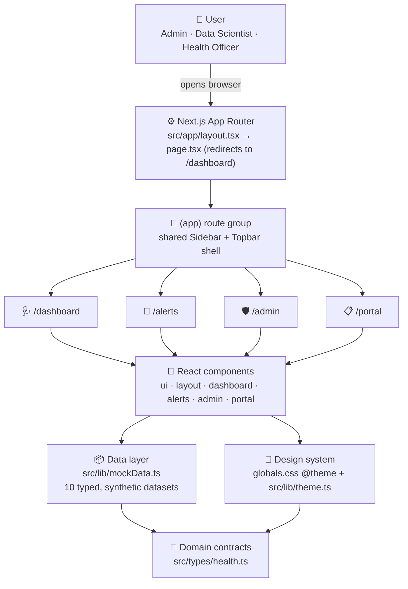
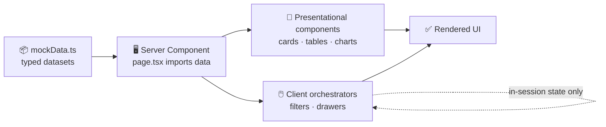

<div align="center">

# 🦠 HealthWatch NG

### A public-health analytics platform for **Nigerian disease-outbreak monitoring**

Surveillance dashboards, outbreak-alert triage, forecasting and weekly epidemiological
reporting for all **36 states + the FCT** — in one clean, responsive web app.

[](https://nextjs.org)
[](https://react.dev)
[](https://www.typescriptlang.org)
[](https://tailwindcss.com)
[](https://recharts.org)

</div>

---

## 📑 Table of contents

- [What is HealthWatch NG?](#-what-is-healthwatch-ng)
- [Features at a glance](#-features-at-a-glance)
- [System architecture](#-system-architecture)
- [How data flows through the app](#-how-data-flows-through-the-app)
- [The four modules in detail](#-the-four-modules-in-detail)
- [Tech stack](#-tech-stack)
- [Project structure](#-project-structure)
- [Domain model](#-domain-model-the-data-the-app-understands)
- [Design system](#-design-system)
- [Getting started](#-getting-started)
- [From demo to production](#-from-demo-to-production)
- [Disclaimer](#-disclaimer)

---

## 🌍 What is HealthWatch NG?

> **In plain English:** Imagine a control room for a country's health agency. On the
> walls are live boards showing where diseases are spreading, how fast, and where to
> send help next. **HealthWatch NG is that control room, as a website.**

It brings four jobs that are usually scattered across spreadsheets and emails into a
single screen:

1. **Watch** — see the national outbreak picture at a glance (active cases, hotspots, trends).
2. **Respond** — triage incoming outbreak alerts, investigate them, and mark them handled.
3. **Administer** — manage who has access, which data feeds are healthy, and what everyone did (audit trail).
4. **Plan ahead** — read short-term forecasts and a ready-to-share weekly epidemiological report.

Each job maps to one page in the app, and every page shares the same sidebar + top-bar
frame so the experience feels like one connected system.

---

## ✨ Features at a glance

| Page | What it does | Who it's for |
| --- | --- | --- |
| 🩺 **`/dashboard`** | Headline stats, 12-week case-trend chart, a colour-coded risk grid for all 36 states + FCT, and a recent-alerts feed | ML Engineer / Data Scientist |
| 🔔 **`/alerts`** | Filterable outbreak-alert table with a detail slide-over and an **Acknowledge** action | Backend / Platform Engineer |
| 🛡️ **`/admin`** | Three tabs — **Users**, **Data Sources** (feed health) and an immutable **Audit Log** | System Admin |
| 📋 **`/portal`** | 4-week cholera forecast with a confidence band, high-risk LGA watchlist, and a downloadable weekly epi report | Health Officer / Epidemiologist |

Other niceties: fully **responsive** (sidebar collapses on mobile), **strictly typed**
(no `any` anywhere), **server-rendered** by default, and a **single design-token source**
so every risk colour is consistent across charts, tables and badges.

---

## 🏗️ System architecture

HealthWatch NG is a **single-page-feel, server-rendered web application**. There is
**no backend or database today** — every figure comes from a typed, in-repo data layer
(`src/lib/mockData.ts`). That keeps the demo instant to run while the architecture stays
shaped so a real API can be dropped in later with minimal change.



**The three layers, explained for any reader:**

| Layer | Folder | Job |
| --- | --- | --- |
| **Presentation** | `src/app`, `src/components` | The pages and reusable building blocks the user sees and clicks. |
| **Data** | `src/lib/mockData.ts` | The "single source of truth" for every number on screen — today it's realistic synthetic data; tomorrow it can be a real API call. |
| **Contracts & design** | `src/types`, `src/lib/theme.ts`, `globals.css` | The rules: what the data must look like (types) and how it must be coloured/styled (tokens). |

**Server vs. client — where the work happens:** Pages render on the **server** by
default (fast first paint, no shipped JavaScript for static content). Only the genuinely
interactive parts opt into the browser with `"use client"`:

- `AppShell` — owns the open/close state of the responsive sidebar.
- `AlertsClient` — owns alert filtering, the selected-row drawer, and the in-session acknowledge state.
- Charts (Recharts) and the interactive admin tabs.

---

## 🔁 How data flows through the app

The same predictable path is used everywhere, which makes the codebase easy to reason about:



1. A **page** (server component) imports the dataset(s) it needs from `mockData.ts`.
2. It passes that data down to **presentational components** (charts, tables, stat cards).
3. Interactive behaviour lives in **client components** that hold local React state.
4. Actions like *acknowledge an alert* or *apply a filter* update **in-session state only** — they reset on page reload, because there is no persistence layer yet (by design, for a demo).

---

## 🧭 The four modules in detail

### 🩺 Disease Surveillance Dashboard — `/dashboard`
The national picture in one screen: four **summary stat cards** (active cases, active
outbreaks, states affected, mean detection time), a **12-week multi-disease trend chart**
(Lassa Fever, Cholera, Meningitis), a **risk grid** of all 36 states + FCT colour-coded by
severity, and a **recent-alerts** feed.

### 🔔 Outbreak Alert Management — `/alerts`
A working triage queue. Filter alerts by **disease, risk, state and status**; click any
row to open a **detail drawer** showing case count, fatalities, contacts traced and
detection time; then **Acknowledge** to move it through its lifecycle
(`Active → Investigating → Acknowledged → Resolved`).

### 🛡️ Admin Panel — `/admin`
Three tabs behind one page:
- **Users** — platform accounts with role badges (System Admin, Data Engineer, Data Scientist, Health Officer, State Coordinator).
- **Data Sources** — upstream feed health (`Connected · Degraded · Offline`) with last-sync time and record counts.
- **Audit Log** — an immutable trail of system events (`Auth · Data · Config · Export · Alert`) for compliance.

### 📋 Public Health Officer Portal — `/portal`
The forward-looking, field-facing view: a **4-week cholera forecast** with a
prediction confidence band, a **high-risk LGA watchlist** (trend + week-over-week change),
a headline **weekly epidemiological report card** (recovery rate, case-fatality rate,
states reporting) and a **download report** action.

---

## 🛠️ Tech stack

| Concern | Choice | Why |
| --- | --- | --- |
| Framework | **Next.js 16** (App Router) | Server components, file-based routing, route groups |
| UI library | **React 19** | Component model + hooks for the interactive views |
| Language | **TypeScript 5** | Strict, fully-typed domain — `no-any` policy |
| Styling | **Tailwind CSS v4** | Utility-first, with design tokens declared in `@theme` |
| Charts | **Recharts 3** | Trend lines, risk grids, forecast confidence bands |
| Icons | **lucide-react** | Consistent, lightweight icon set |
| Class utilities | **clsx + tailwind-merge** | Safe conditional class names (`cn()` helper) |
| Tooling | **ESLint 9** (`eslint-config-next`) | Linting and code-quality gate |

---

## 📂 Project structure

```text
src/
├─ app/
│  ├─ (app)/                 # Route group: shares the Sidebar + Topbar shell
│  │  ├─ layout.tsx          #   wraps every page below in <AppShell>
│  │  ├─ dashboard/page.tsx  #   🩺 Surveillance
│  │  ├─ alerts/page.tsx     #   🔔 Alert management
│  │  ├─ admin/page.tsx      #   🛡️ Admin panel
│  │  └─ portal/page.tsx     #   📋 Officer portal
│  ├─ layout.tsx             # Root layout (fonts, metadata, <html>)
│  ├─ page.tsx               # Landing → redirects to /dashboard
│  └─ globals.css            # Tailwind v4 import + @theme design tokens
│
├─ components/
│  ├─ ui/                    # Primitives: Card, Badge, StatCard
│  ├─ layout/                # AppShell, Sidebar, Topbar
│  ├─ dashboard/             # CaseTrendChart, StateRiskGrid, RecentAlerts
│  ├─ alerts/                # AlertsClient, AlertsTable, AlertFilters, AlertDrawer
│  ├─ admin/                 # AdminTabs, UsersTab, DataSourcesTab, AuditLogTab
│  └─ portal/                # ForecastChart, HighRiskLGATable, EpiReportCard, DownloadReportButton
│
├─ lib/
│  ├─ mockData.ts            # 📦 All synthetic datasets (the data layer)
│  ├─ theme.ts               # 🎨 Runtime colour maps for dynamic values
│  ├─ nav.ts                 # 🧭 Single source of routes (sidebar + navbar)
│  └─ utils.ts               # 🔧 cn(), formatNumber, timeAgo, formatDate…
│
└─ types/
   └─ health.ts              # 📐 Every domain interface — no `any`
```

---

## 📐 Domain model (the "data the app understands")

All domain types live in one file — `src/types/health.ts` — so the data shape is a
single, framework-agnostic contract. Highlights:

| Type | Represents |
| --- | --- |
| `StateRisk` | A state/FCT with its current risk level, active cases and dominant disease |
| `OutbreakAlert` | A single alert: disease, LGA, risk, case count, status, fatalities, detection time |
| `WeeklyCaseTrend` | One week of national case counts, per disease, for the trend chart |
| `PlatformUser` | An admin-managed account with a `UserRole` |
| `DataSource` | An upstream feed with a `SourceStatus` and last-sync time |
| `AuditEntry` | One immutable, categorised system event |
| `ForecastPoint` | A predicted value with lower/upper confidence bounds |
| `HighRiskLGA` | An LGA flagged as elevated risk, with trend + % change |
| `EpiReportSummary` | Headline figures for the weekly epidemiological report |
| `SummaryStat` | A single headline metric card on the dashboard |

Supporting unions keep values honest across the whole app: `RiskLevel`
(`Low · Medium · High · Critical`), `Disease`, `AlertStatus`, `UserRole`, `SourceStatus`.

---

## 🎨 Design system

A single source of truth for colour, so a "High risk" looks identical on a chart, a table
cell and a badge.

- **Brand:** Nigerian green `#006B3F`
- **Risk levels:** Low `#059669` · Medium `#D97706` · High `#DC2626` · Critical `#7C3AED`
- **Tokens** are declared once in `src/app/globals.css` (`@theme` → Tailwind utilities like
  `bg-brand`) and mirrored in `src/lib/theme.ts` for values that must be applied at
  **runtime from data** (Tailwind can't generate classes from dynamic strings, so these
  are consumed as inline styles).

---

## 🚀 Getting started

**Prerequisites:** Node.js 18.18+ (Node 20 LTS recommended) and npm.

```bash
# 1. Install dependencies
npm install

# 2. Start the dev server
npm run dev          # → http://localhost:3000  (opens on /dashboard)

# 3. Build for production / run the production server
npm run build
npm run start

# 4. Lint
npm run lint
```

| Script | What it does |
| --- | --- |
| `npm run dev` | Start the local development server with hot reload |
| `npm run build` | Create an optimised production build |
| `npm run start` | Serve the production build |
| `npm run lint` | Run ESLint across the project |

---

## 🔭 From demo to production

The app is intentionally structured so the "data layer" is the only thing that needs to
change to make this real. A production rollout would typically add:

- [ ] **Real data feeds** — swap `src/lib/mockData.ts` for API/DB calls (e.g. NCDC SORMAS, DHIS2) behind the same `src/types/health.ts` contracts.
- [ ] **Persistence** — a database so acknowledgements, filters and audit entries survive reloads.
- [ ] **Authentication & authorisation** — real login, with the existing `UserRole` enum driving access.
- [ ] **Live forecasting** — replace the static forecast with a model service feeding `ForecastPoint`s.
- [ ] **Notifications** — push/email when a new high-risk alert fires.

Because the UI already speaks in typed domain contracts, each of these is an additive
change rather than a rewrite.

---

## ⚠️ Disclaimer

> **This is a demo application.** Every figure in `src/lib/mockData.ts` is **synthetic**
> — generated to be realistic (all 36 states + FCT, real LGA names, NCDC-style
> surveillance figures) but **not real surveillance data**. It must not be used for
> actual public-health decision-making.
