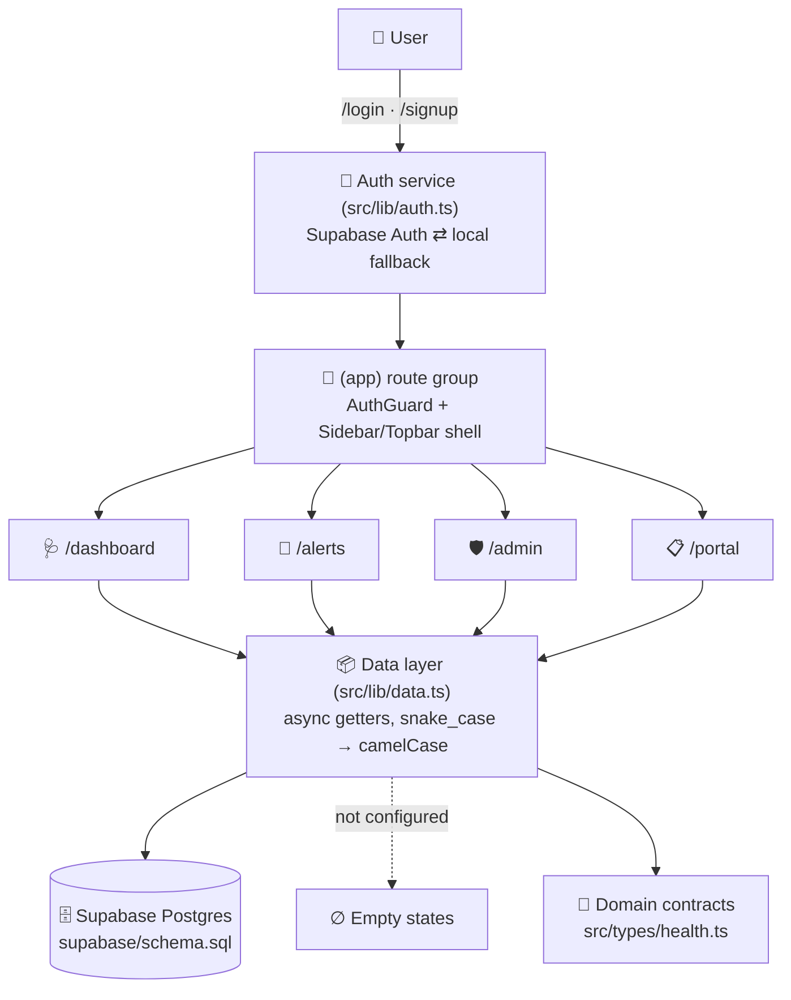

<div align="center">

# 🦠 HealthWatch NG

### A public-health analytics platform for **Nigerian disease-outbreak monitoring**

Surveillance dashboards, outbreak-alert triage, forecasting and weekly epidemiological
reporting for all **36 states + the FCT** — in one clean, responsive web app.

[](https://nextjs.org)
[](https://react.dev)
[](https://www.typescriptlang.org)
[](https://tailwindcss.com)
[](https://supabase.com)
[](https://recharts.org)

</div>

---

## 🌍 What is HealthWatch NG?

> **In plain English:** Imagine a control room for a country's health agency. On the
> walls are live boards showing where diseases are spreading, how fast, and where to
> send help next. **HealthWatch NG is that control room, as a website.**

It brings four jobs that are usually scattered across spreadsheets and emails into a
single screen:

1. **Watch** — see the national outbreak picture at a glance (active cases, hotspots, trends).
2. **Respond** — triage incoming outbreak alerts, investigate them, and mark them handled.
3. **Administer** — manage who has access, which data feeds are healthy, and what everyone did (audit trail).
4. **Plan ahead** — read short-term forecasts and a ready-to-share weekly epidemiological report.

| Page | What it does |
| --- | --- |
| 🩺 **`/dashboard`** | Headline stats (derived live from the data), a multi-disease trend chart, a colour-coded risk grid for all 36 states + FCT, and a recent-alerts feed |
| 🔔 **`/alerts`** | Filterable outbreak-alert table with a detail slide-over and an **Acknowledge** action |
| 🛡️ **`/admin`** | Three tabs — **Users**, **Data Sources** (feed health) and an immutable **Audit Log** |
| 📋 **`/portal`** | 4-week cholera forecast with a confidence band, high-risk LGA watchlist, and a downloadable weekly epi report |
| 🔑 **`/login` · `/signup`** | Email/password authentication — every other page requires a session |

---

## 🏗️ Architecture

The app is **Supabase-ready with graceful fallback** — it runs in two modes decided
entirely by environment variables:

- **Local mode** (no env vars): auth is handled in the browser (self-registered
  accounts with SHA-256-hashed passwords in localStorage) and every dataset resolves
  empty, so each view shows a helpful empty state.
- **Supabase mode** (`.env.local` filled in): sign-in/sign-up go through **Supabase
  Auth** and every dataset is fetched live from Postgres tables.


```mermaid
flowchart TD
    U["👤 User"] -->|/login · /signup| AUTH["🔑 Auth service (src/lib/auth.ts)<br/>Supabase Auth ⇄ local fallback"]
    AUTH --> RG["🧩 (app) route group<br/>AuthGuard + Sidebar/Topbar shell"]

    RG --> D["🩺 /dashboard"]
    RG --> A["🔔 /alerts"]
    RG --> AD["🛡️ /admin"]
    RG --> P["📋 /portal"]

    D & A & AD & P --> DATA["📦 Data layer (src/lib/data.ts)<br/>async getters, snake_case → camelCase"]
    DATA --> SB[("🗄️ Supabase Postgres<br/>supabase/schema.sql")]
    DATA -.->|not configured| EMPTY["∅ Empty states"]
    DATA --> TYPES["📐 Domain contracts<br/>src/types/health.ts"]
```

**The flow on every page:** an async **server component** page calls typed getters
from `src/lib/data.ts` and passes the results down as **props** to presentational
components. Interactive behaviour (filters, drawers, tab switching, acknowledgements)
lives in `"use client"` components holding local state.

---

## 🚀 Getting started

**Prerequisites:** Node.js 18.18+ (Node 20 LTS recommended) and npm.

```bash
# 1. Install dependencies
npm install

# 2. Start the dev server (local mode — no backend needed)
npm run dev          # → http://localhost:3000

# 3. Build for production / run the production server
npm run build
npm run start

# 4. Lint
npm run lint
```

In local mode, create an account on **/signup** first — name, role, state of origin,
email, phone and password — then you're signed in.

### Connecting Supabase

1. Create a project at [supabase.com](https://supabase.com).
2. Copy `.env.example` → `.env.local` and fill in `NEXT_PUBLIC_SUPABASE_URL` and
   `NEXT_PUBLIC_SUPABASE_ANON_KEY` (Settings → API).
3. Run `supabase/schema.sql` in the SQL editor — it creates the `profiles` table
   (auto-populated on signup via trigger), all surveillance tables, and RLS policies.
4. Restart the dev server. Signup/login now go through Supabase Auth, and any rows
   you load into the tables appear in the app immediately.

| Table | Feeds |
| --- | --- |
| `profiles` | Admin → Users tab (one row per signup) |
| `state_risks` | Dashboard risk grid + active-case stats |
| `outbreak_alerts` | Alerts page, recent-alerts feed, unread badge |
| `weekly_case_trends` | Dashboard trend chart |
| `data_sources` | Admin → Data Sources tab |
| `audit_log` | Admin → Audit Log tab |
| `forecast_points` | Portal forecast chart |
| `high_risk_lgas` | Portal LGA watchlist |
| `epi_reports` | Portal weekly epi report (latest row) |

---

## 🛠️ Tech stack

| Concern | Choice |
| --- | --- |
| Framework | **Next.js 16** (App Router, server components, dynamic rendering) |
| UI library | **React 19** |
| Language | **TypeScript 5** — strict, fully-typed domain, no `any` |
| Backend | **Supabase** (Auth + Postgres), optional at dev time |
| Styling | **Tailwind CSS v4** with `@theme` design tokens |
| Charts | **Recharts 3** |
| Icons | **lucide-react** |

## 📂 Project structure

```text
src/
├─ app/
│  ├─ (app)/                 # Guarded route group (force-dynamic, AuthGuard + shell)
│  │  ├─ dashboard/ alerts/ admin/ portal/
│  ├─ login/  signup/        # Public auth pages
│  ├─ layout.tsx             # Root layout (fonts, metadata, AuthProvider)
│  └─ globals.css            # Tailwind v4 import + @theme design tokens
├─ components/
│  ├─ auth/                  # AuthProvider, AuthGuard, AuthScreen, Login/Signup forms
│  ├─ ui/                    # Card, Badge, StatCard, EmptyState
│  ├─ layout/                # AppShell, Sidebar, Topbar
│  ├─ dashboard/ alerts/ admin/ portal/
├─ lib/
│  ├─ supabase.ts            # Lazy Supabase client + isSupabaseConfigured
│  ├─ data.ts                # Typed async getters (Supabase or empty)
│  ├─ auth.ts                # Dual-mode auth service
│  ├─ states.ts              # Static 36 states + FCT reference list
│  ├─ theme.ts  nav.ts  utils.ts
└─ types/
   └─ health.ts              # Every domain interface
supabase/
└─ schema.sql                # Tables, signup trigger, RLS policies
```

---

## ⚠️ Notes

- Server components read Supabase with the **anon key**, so the schema grants
  `SELECT` to the anon role. To lock reads behind authentication, migrate the app to
  `@supabase/ssr` cookie sessions and tighten the policies (noted in `schema.sql`).
- Alert acknowledgements are in-session only for now; wiring them to an `UPDATE` on
  `outbreak_alerts` is the natural next step.
