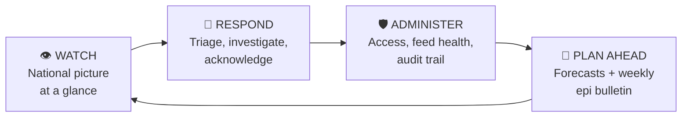
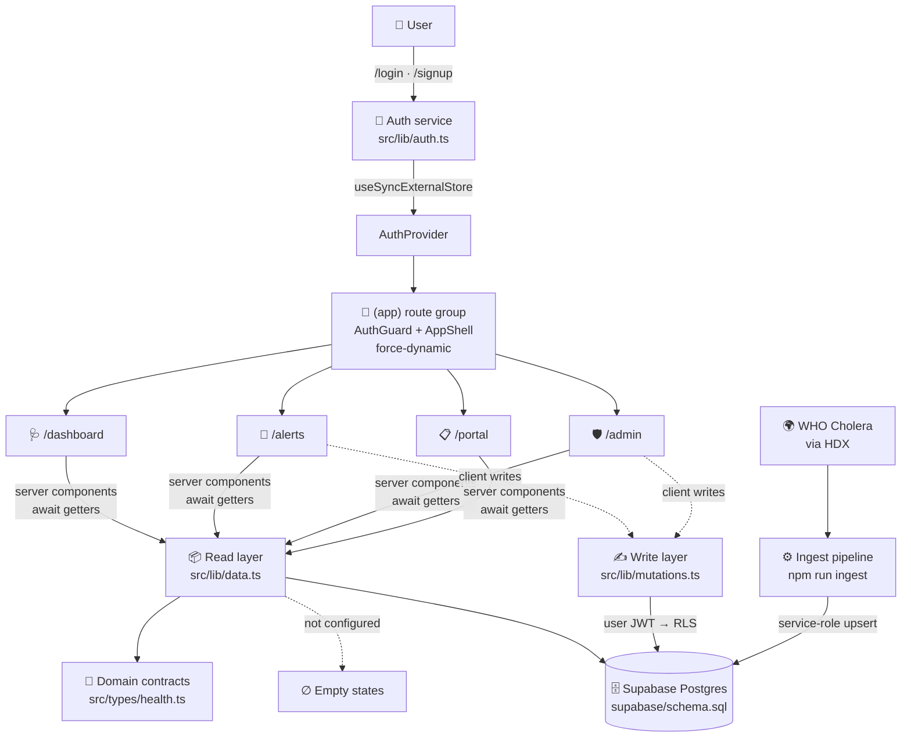
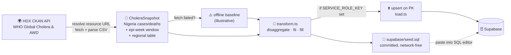
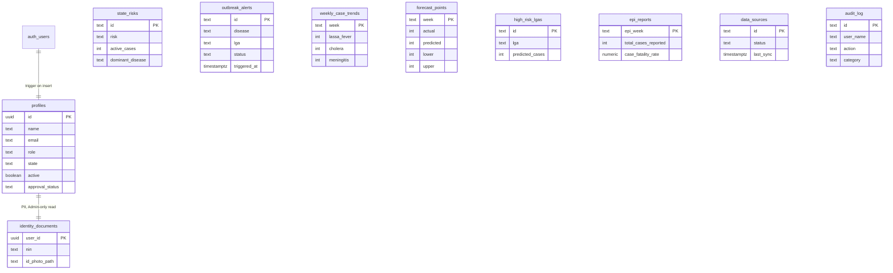
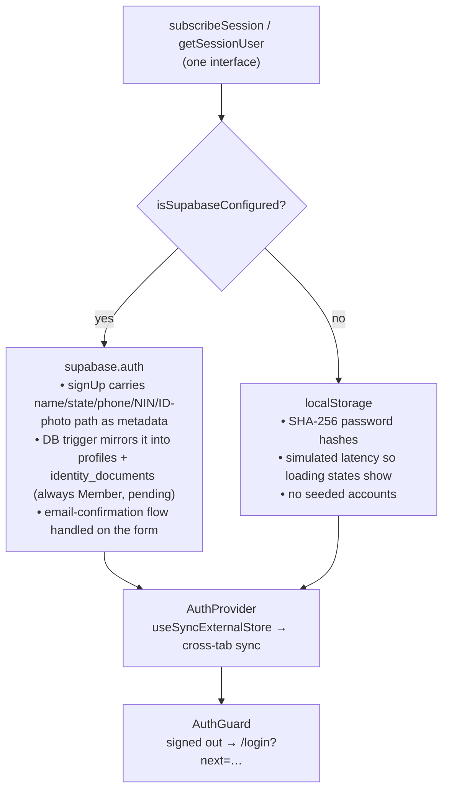

<div align="center">

# 🦠 HealthWatch NG

### A public-health analytics platform for **Nigerian disease-outbreak surveillance**

Outbreak dashboards, alert triage, forecasting and weekly epidemiological reporting
for all **36 states + the FCT** — in one responsive, fully-typed web app.

[](https://nextjs.org)
[](https://react.dev)
[](https://www.typescriptlang.org)
[](https://tailwindcss.com)
[](https://supabase.com)
[](https://recharts.org)

</div>

---

## 📑 Table of contents

- [The problem](#-the-problem)
- [What HealthWatch NG does](#-what-healthwatch-ng-does)
- [At a glance](#-at-a-glance)
- [Feature tour](#-feature-tour)
- [Architecture](#️-architecture)
- [The data pipeline](#-the-data-pipeline)
- [Data provenance — the honest version](#-data-provenance--the-honest-version)
- [Data model](#-data-model)
- [Authentication & security](#-authentication--security)
- [Design system](#-design-system)
- [Getting started](#-getting-started)
- [Going live with Supabase](#-going-live-with-supabase)
- [Project structure](#-project-structure)
- [Engineering conventions](#-engineering-conventions)
- [Known gaps & roadmap](#️-known-gaps--roadmap)

---

## 🎯 The problem

Nigeria runs disease surveillance across **37 sub-national jurisdictions** and hundreds
of LGAs. The signals that matter — a cholera cluster in Maiduguri, a Lassa Fever spike
in Owo — arrive as **weekly PDFs, spreadsheets and emails**. By the time a number is
aggregated, cross-checked and circulated, the window in which a response is cheap has
usually closed.

Three concrete failures follow from that:

| Failure | Consequence |
| --- | --- |
| **No single view** | Nobody can answer "where is it worst *right now*?" without collating files |
| **Slow triage** | Alerts have no lifecycle — there's no record of who saw what, or when |
| **No forward look** | Response is reactive; resources arrive after the peak, not before it |

## 💡 What HealthWatch NG does

> **In plain English:** picture the control room of a national health agency — wall
> boards showing where disease is spreading, how fast, and where to send help next.
> **HealthWatch NG is that control room, as a web app.**

It collapses four jobs into one screen:


```mermaid
flowchart LR
    W["👁️ WATCH<br/>National picture<br/>at a glance"] --> R["🚨 RESPOND<br/>Triage, investigate,<br/>acknowledge"]
    R --> A["🛡️ ADMINISTER<br/>Access, feed health,<br/>audit trail"]
    A --> P["🔮 PLAN AHEAD<br/>Forecasts + weekly<br/>epi bulletin"]
    P --> W
```

1. **Watch** — the national outbreak picture: active cases, hotspots, multi-disease trends.
2. **Respond** — triage incoming alerts, open the detail drawer, mark them acknowledged.
3. **Administer** — manage who has access, see which feeds are healthy, read the audit trail.
4. **Plan ahead** — read a forward forecast with a confidence band, download the weekly bulletin as a PDF.

## 📊 At a glance

| | |
| --- | --- |
| **Guarded pages** | 4 (`/dashboard`, `/alerts`, `/admin`, `/portal`) |
| **Public pages** | 2 (`/login`, `/signup`) |
| **Postgres tables** | 10 (8 surveillance datasets + `profiles` + `identity_documents`) |
| **Jurisdictions covered** | 37 — 36 states + the FCT |
| **Diseases under surveillance** | 5 — Lassa Fever, Cholera, Cerebrospinal Meningitis, Monkeypox, Malaria |
| **User roles** | 2 — one SQL-seeded **Admin**, and **Member** for everyone who registers |
| **Source lines** | ~5,600 across TS/TSX/SQL/CSS |
| **`any` types** | 0 — strict TypeScript throughout |

---

## 🧭 Feature tour

| Page | What it does |
| --- | --- |
| 🩺 **`/dashboard`** | Four headline stat cards with **period-over-period deltas derived from the data itself**, a 12-week multi-disease trend chart, a colour-coded risk grid for all 37 jurisdictions, and a recent-alerts feed |
| 🔔 **`/alerts`** | Filterable alert table (disease · risk · state · status), a detail slide-over drawer, and an **Acknowledge** action that writes back to Postgres with optimistic UI and rollback on failure |
| 🛡️ **`/admin`** | Six tabs — **Pending Approvals** (review NIN + ID document, approve/reject), **Users** (persisted active/inactive toggle), **Alerts** (full CRUD), **State Risks** (per-state posture editing), **Data Sources** (feed health + CRUD + a **Refresh live data** button that runs the WHO/HDX ingest server-side), and an immutable **Audit Log** |
| 📋 **`/portal`** | National cholera forecast with a shaded confidence band, a top-5 high-risk LGA watchlist, and a **real PDF bulletin** generated client-side with jsPDF |
| 🔑 **`/login` · `/signup`** | Email/password auth with full field validation (including Nigerian mobile-number patterns). Anyone can register as a **Member** with their 11-digit NIN and one government-ID photo; sign-in stays blocked until the Admin approves the registration |

### Interaction details worth knowing

- **Stat-card deltas are computed, not stored.** Active cases compare the latest two epi
  weeks; the alert-driven metrics compare the last 7 days against the prior 7 using each
  alert's `triggeredAt`. No figure on the dashboard is hard-coded. See
  [`deriveStatDeltas`](src/app/%28app%29/dashboard/page.tsx#L47).
- **"Up" is red.** For cases, outbreaks and detection time, a rising number is bad — the
  [`StatCard`](src/components/ui/StatCard.tsx) colours it accordingly rather than using the
  usual green-is-up convention.
- **Writes are optimistic with rollback.** Acknowledging an alert or toggling a user flips
  the UI immediately, then persists; a failed write reverts the row and logs the error.
- **The notification bell is live.** Unread count = alerts still `Active` or `Investigating`,
  computed in the route-group layout and passed into the shell.

---

## 🏗️ Architecture

The app is **Supabase-ready with graceful fallback** — its behaviour is decided entirely
by two environment variables:

- **Local mode** (no env vars): auth runs in the browser (self-registered accounts,
  SHA-256-hashed passwords in `localStorage`); every dataset resolves empty, so each view
  renders a purposeful empty state. No backend needed to run the app.
- **Supabase mode** (`.env.local` filled in): sign-in/sign-up go through **Supabase Auth**,
  and every dataset is fetched live from Postgres.


```mermaid
flowchart TD
    U["👤 User"] -->|/login · /signup| AUTH["🔑 Auth service<br/>src/lib/auth.ts"]
    AUTH -->|"useSyncExternalStore"| AP["AuthProvider"]
    AP --> RG["🧩 (app) route group<br/>AuthGuard + AppShell<br/>force-dynamic"]

    RG --> D["🩺 /dashboard"]
    RG --> A["🔔 /alerts"]
    RG --> AD["🛡️ /admin"]
    RG --> P["📋 /portal"]

    D & A & AD & P -->|"server components<br/>await getters"| DATA["📦 Read layer<br/>src/lib/data.ts"]
    A & AD -.->|"client writes"| MUT["✍️ Write layer<br/>src/lib/mutations.ts"]

    DATA --> SB[("🗄️ Supabase Postgres<br/>supabase/schema.sql")]
    MUT -->|"user JWT → RLS"| SB
    DATA -.->|not configured| EMPTY["∅ Empty states"]

    ING["⚙️ Ingest pipeline<br/>npm run ingest"] -->|service-role upsert| SB
    WHO["🌍 WHO Cholera<br/>via HDX"] --> ING

    DATA --> TYPES["📐 Domain contracts<br/>src/types/health.ts"]
```

### The one data-flow pattern

Every page follows the same shape, and the discipline is enforced by convention:

```
async server component page
        ↓ await getStateRisks() / getOutbreakAlerts() / …
   typed getter in src/lib/data.ts
        ↓ snake_case row → camelCase domain type
   presentational component (props only)
        ↓ empty array?
   <EmptyState />
```

**Components never fetch.** Data enters exclusively via props. Interactive behaviour
(filters, drawers, tabs, acknowledgements) lives in `"use client"` components that hold
local state and call the write layer. This keeps the server/client boundary legible and
means any component can be rendered in isolation with fixture props.

### Layer responsibilities

| Layer | File(s) | Responsibility |
| --- | --- | --- |
| **Domain contracts** | [`src/types/health.ts`](src/types/health.ts) | Every interface and union in the domain. Framework-agnostic, no imports. |
| **Read layer** | [`src/lib/data.ts`](src/lib/data.ts) | 9 async getters. One `fetchRows` helper + per-table mappers. Never throws — logs and returns `[]`. |
| **Write layer** | [`src/lib/mutations.ts`](src/lib/mutations.ts) | Browser-side writes carrying the user's JWT, so RLS applies. Returns a `MutationResult`, never throws. |
| **Auth service** | [`src/lib/auth.ts`](src/lib/auth.ts) | Dual-mode. Both modes expose one subscribe/snapshot pair. |
| **Design tokens** | [`src/lib/theme.ts`](src/lib/theme.ts) | Runtime colour maps for data-derived values. |
| **Reference data** | [`src/lib/states.ts`](src/lib/states.ts) | The 36 states + FCT. Facts, not data. |

---

## 🔄 The data pipeline

`npm run ingest` is a refreshable, **idempotent** pipeline that turns a real public
health feed into the app's eight surveillance tables. The Admin can also trigger the
same pipeline from the console (**Data Sources → Refresh live data**).


```mermaid
flowchart LR
    HDX["🌍 HDX CKAN API<br/>WHO Global Cholera & AWD"] -->|"resolve resource URL<br/>fetch + parse CSV"| SNAP["📸 CholeraSnapshot<br/>Nigeria cases/deaths<br/>+ epi-week window<br/>+ regional table"]
    SNAP -->|"fetch failed?"| BASE["⚠️ offline baseline<br/>(illustrative)"]
    BASE --> TR
    SNAP --> TR["🔧 transform.ts<br/>disaggregate · fit · fill"]
    TR --> SEED["📄 supabase/seed.sql<br/>committed, network-free"]
    TR -->|"if SERVICE_ROLE_KEY set"| UP["⬆️ upsert on PK<br/>load.ts"]
    UP --> DB[("🗄️ Supabase")]
    SEED -.->|"paste into SQL editor"| DB
```

**Four stages** ([`scripts/ingest.ts`](scripts/ingest.ts)):

1. **Fetch** — resolve the WHO Global Cholera & AWD resource dynamically from the HDX
   CKAN API and parse it. (HDX labels the file XLSX; it is actually CSV, so it's parsed
   format-agnostically, with retries for flaky TLS.) On any failure, fall back to an
   offline baseline so a run *always* produces a populated dataset.
2. **Transform** — expand the one real feed into eight tables ([details below](#-data-provenance--the-honest-version)).
3. **Write `seed.sql`** — always, so the repo carries a committed, network-free snapshot.
4. **Upsert** — only if `SUPABASE_SERVICE_ROLE_KEY` is present. Upserts on the primary key,
   so re-running refreshes rows in place rather than duplicating them.

Every run prints a **provenance summary** naming each table's row count and origin.

### Determinism by design

There is **no `Math.random()` anywhere in the pipeline**. Every "random" value comes from a
seeded mulberry32 PRNG in [`reference.ts`](scripts/ingest/reference.ts), keyed on a fixed
string (`"alerts"`, `"states"`, `"lgas"`, …). Consequences:

- Re-running produces the same dataset → upserts are genuinely idempotent.
- `seed.sql` diffs stay small and reviewable.
- The pipeline is safe to run on a cron schedule.

---

## 🔬 Data provenance — the honest version

This is the part most dashboards quietly skip. HealthWatch NG labels every table with
where its numbers came from, in three tiers:

| Tier | Meaning |
| --- | --- |
| 🟢 **real** | A genuine WHO/pipeline figure, unmodified |
| 🟡 **modelled** | *Computed from* a real figure. The **magnitude is real**; only the distribution is inferred |
| 🔴 **synthetic** | A deterministic placeholder where **no public feed exists** |

| Table | Provenance | How it's derived |
| --- | --- | --- |
| `epi_reports` | 🟢 real | Nigeria's cumulative cases/deaths; CFR computed directly from them |
| `data_sources` | 🟢 real | Actual run metadata — source name, sync timestamp, record count, live/degraded |
| `weekly_case_trends` | 🟡 modelled | Real cumulative cholera total, disaggregated across the epi-week window by a seasonal wet-season weight curve |
| `forecast_points` | 🟡 modelled | Least-squares fit over the last 8 modelled weeks, projected 6 weeks forward with a residual-stddev band that widens with horizon |
| `state_risks` | 🔴 synthetic | Per-state split of a caseload anchored to the real recent cholera burden |
| `outbreak_alerts` | 🔴 synthetic | Realistic LGA-level template; no public sub-national weekly feed exists |
| `high_risk_lgas` | 🔴 synthetic | Derived from the alert template |
| `audit_log` | 🔴 synthetic | Except the top row, which is a real ingest event including Nigeria's rank among reporting countries |

**The rule the codebase holds to: no synthetic number is ever presented to the user as
real.** The provenance table is written into the header of every generated `seed.sql`, and
the Admin → Data Sources tab shows the true state of each upstream feed — including the two
that are honestly marked *Degraded* (NCDC IDSR, PDF-only) and *Offline* (DHIS2, connector
not built).

---

## 🗄️ Data model

Ten tables, all with Row Level Security enabled.


```mermaid
erDiagram
    auth_users ||--|| profiles : "trigger on insert"
    profiles ||--|| identity_documents : "PII, Admin-only read"
    profiles {
        uuid id PK
        text name
        text email
        text role
        text state
        boolean active
        text approval_status
    }
    identity_documents {
        uuid user_id PK
        text nin
        text id_photo_path
    }
    state_risks {
        text id PK
        text risk
        int active_cases
        text dominant_disease
    }
    outbreak_alerts {
        text id PK
        text disease
        text lga
        text status
        timestamptz triggered_at
    }
    weekly_case_trends {
        text week PK
        int lassa_fever
        int cholera
        int meningitis
    }
    forecast_points {
        text week PK
        int actual
        int predicted
        int lower
        int upper
    }
    high_risk_lgas {
        text id PK
        text lga
        int predicted_cases
    }
    epi_reports {
        text epi_week PK
        int total_cases_reported
        numeric case_fatality_rate
    }
    data_sources {
        text id PK
        text status
        timestamptz last_sync
    }
    audit_log {
        text id PK
        text user_name
        text action
        text category
    }
```

| Table | Feeds | Read by |
| --- | --- | --- |
| `profiles` | Admin → Users / Pending Approvals | `getPlatformUsers()` |
| `identity_documents` | Admin → Pending Approvals (browser-only, Admin JWT) | `getPendingApprovals()` |
| `state_risks` | Risk grid + active-case stat | `getStateRisks()` |
| `outbreak_alerts` | Alerts page, recent feed, unread badge | `getOutbreakAlerts()` |
| `weekly_case_trends` | Dashboard trend chart | `getWeeklyCaseTrends()` |
| `data_sources` | Admin → Data Sources | `getDataSources()` |
| `audit_log` | Admin → Audit Log (latest 200) | `getAuditLog()` |
| `forecast_points` | Portal forecast chart | `getCholeraForecast()` |
| `high_risk_lgas` | Portal watchlist (top 5) | `getHighRiskLGAs()` |
| `epi_reports` | Portal bulletin (latest row) | `getEpiReport()` |

Column names are **snake_case in Postgres, camelCase in the app** — the mapping lives in
one place per table, in `data.ts`. Domain constraints are enforced in *both* layers: SQL
`check` constraints mirror the TypeScript unions.

---

## 🔐 Authentication & security

### Dual-mode auth


```mermaid
flowchart TD
    S["subscribeSession / getSessionUser<br/>(one interface)"] --> C{"isSupabaseConfigured?"}
    C -->|yes| SUP["supabase.auth<br/>• signUp carries name/state/phone/NIN/ID-photo path as metadata<br/>• DB trigger mirrors it into profiles + identity_documents (always Member, pending)<br/>• email-confirmation flow handled on the form"]
    C -->|no| LOC["localStorage<br/>• SHA-256 password hashes<br/>• simulated latency so loading states show<br/>• no seeded accounts"]
    SUP & LOC --> AP["AuthProvider<br/>useSyncExternalStore → cross-tab sync"]
    AP --> G["AuthGuard<br/>signed out → /login?next=…"]
```

Both modes surface the session through **one** subscribe/snapshot pair, so no component
knows or cares which mode is active. `AuthGuard` distinguishes *"still checking"* from
*"signed out"* — it shows a splash during restore rather than flashing the login page.

### Row Level Security

| Operation | Policy | Rationale |
| --- | --- | --- |
| **Read** (most tables) | `to anon, authenticated` | Server components fetch with the anon key; the browser session isn't forwarded to the server |
| **Read identity documents** | `public.is_admin()` | NIN + ID photos are PII — never on the anon path; the approvals tab fetches them in the browser with the Admin's JWT |
| **Update own profile** | `auth.uid() = id` | Users may edit their own name/phone |
| **Update any profile** | `public.is_admin()` | The admin active/inactive toggle |
| **Approve/reject registrations** | `review_user()` RPC | Column grants strip `role`/`approval_status` from direct UPDATE — no self-approval |
| **Acknowledge alerts** | `acknowledge_alert()` RPC | Any signed-in member may acknowledge; the RPC can only flip status |
| **Edit alerts / state risks / data sources** | `public.is_admin()` | The Admin Console's content tabs |
| **Ingest writes** | service-role key | Bypasses RLS entirely; server-only (`npm run ingest` + the admin refresh route) |

`is_admin()` is declared `security definer` specifically so its `profiles` lookup does
**not** re-trigger the profiles RLS policy — which would recurse.

> ⚠️ **Known trade-off:** because server components read with the anon key, surveillance
> reads are effectively public to anyone with the anon key. Tightening this means migrating
> to `@supabase/ssr` cookie sessions and flipping `to anon, authenticated` → `to authenticated`.
> This is documented inline in [`schema.sql`](supabase/schema.sql#L132).

---

## 🎨 Design system

Colour uses a deliberate **dual-token setup**, because Tailwind cannot generate classes
from dynamic strings:

| Token kind | Where | Used for |
| --- | --- | --- |
| **Static** | `@theme` in [`globals.css`](src/app/globals.css) | Fixed brand colours as utilities — `bg-brand`, `text-brand-dark` |
| **Runtime** | maps in [`theme.ts`](src/lib/theme.ts) | Values derived *from data* — applied as inline styles |

The runtime maps — `RISK_STYLES`, `STATUS_STYLES`, `SOURCE_STATUS_STYLES`, `ROLE_STYLES`,
`DISEASE_COLORS` — each expose a `{ solid, bg, fg }` triple so a dot, a badge tint and its
readable text colour always come from one decision.

**The rule: when colouring by a domain value (risk, status, role, disease), use the
`theme.ts` maps — never a hand-picked hex.**

The palette is Nigerian-green (`#006B3F`) with a four-step risk ramp:

| Low | Medium | High | Critical |
| --- | --- | --- | --- |
| 🟢 `#059669` | 🟠 `#D97706` | 🔴 `#DC2626` | 🟣 `#7C3AED` |

Other conventions: `cn()` from [`utils.ts`](src/lib/utils.ts) for conditional classes;
`formatNumber` / `timeAgo` / `formatDate` / `formatDateTime` for all display formatting
(`en-NG` and `en-GB` locales); every source file opens with a
`// Module: … | Owner: …` header.

---

## 🚀 Getting started

**Prerequisites:** Node.js 18.18+ (Node 20 LTS recommended) and npm.

```bash
# 1. Install dependencies
npm install

# 2. Start the dev server — local mode, no backend needed
npm run dev          # → http://localhost:3000  (redirects to /dashboard)

# 3. Production build (also the de-facto typecheck gate)
npm run build
npm run start

# 4. Lint
npm run lint

# 5. Refresh the dataset from the WHO feed
npm run ingest
```

In local mode, create an account on **`/signup`** first — name, state of origin, email,
phone, NIN, an ID photo, password — and you're signed in straight away (local signups are
auto-approved because there is no admin without a backend). There are no seeded demo
accounts, and every dataset is empty, so you'll see each view's empty state. **To see the
app with data, connect Supabase.**

> There is no test runner configured. `npm run build` and `npm run lint` are the
> verification steps.

## 🔌 Going live with Supabase

```bash
cp .env.example .env.local
```

1. Create a project at [supabase.com](https://supabase.com).
2. Fill `NEXT_PUBLIC_SUPABASE_URL` and `NEXT_PUBLIC_SUPABASE_ANON_KEY` from **Settings → API**.
3. Run [`supabase/schema.sql`](supabase/schema.sql) in the SQL editor — tables, the signup
   trigger, `is_admin()`, and every RLS policy.
4. Edit the email/password at the top of [`supabase/seed_admin.sql`](supabase/seed_admin.sql)
   and run it once in the SQL editor — this creates **the single Admin account** (there is
   no UI path to admin, ever). Sign in with it at **`/admin`**.
5. Load data, either way:
   - **Fast:** paste [`supabase/seed.sql`](supabase/seed.sql) into the SQL editor (committed
     snapshot, no network needed).
   - **Fresh:** add `SUPABASE_URL` + `SUPABASE_SERVICE_ROLE_KEY` to `.env.local` and run
     `npm run ingest` (or click **Refresh live data** in Admin → Data Sources) to pull live
     WHO figures and upsert them.
6. Restart the dev server. Auth now goes through Supabase and every view lights up. New
   `/signup` registrations become pending **Members** — approve them from
   **Admin → Pending Approvals**.

> 🔒 `SUPABASE_SERVICE_ROLE_KEY` bypasses RLS. It is **server-only** — never prefix it with
> `NEXT_PUBLIC_`, never ship it to the browser. It is used by `npm run ingest` and the
> admin-only `/api/admin/refresh-data` route.

---

## 📂 Project structure

```text
src/
├─ app/
│  ├─ (app)/                    # Guarded route group
│  │  ├─ layout.tsx             #   AuthGuard + AppShell, force-dynamic, unread-alert count
│  │  ├─ dashboard/page.tsx     #   stats + trends + risk grid + recent alerts
│  │  ├─ alerts/page.tsx        #   → AlertsClient
│  │  ├─ admin/page.tsx         #   → AdminTabs
│  │  └─ portal/page.tsx        #   forecast + epi report + LGA watchlist
│  ├─ login/  signup/           # Public auth pages
│  ├─ layout.tsx                # Root layout — fonts, metadata, AuthProvider
│  ├─ page.tsx                  # / → redirect to /dashboard
│  └─ globals.css               # Tailwind v4 import + @theme tokens
├─ components/
│  ├─ auth/                     # AuthProvider, AuthGuard, AuthScreen, Login/Signup forms
│  ├─ ui/                       # Card, Badge, StatCard, EmptyState
│  ├─ layout/                   # AppShell, Sidebar, Topbar
│  ├─ dashboard/                # CaseTrendChart, StateRiskGrid, RecentAlerts
│  ├─ alerts/                   # AlertsClient, AlertFilters, AlertsTable, AlertDrawer
│  ├─ admin/                    # AdminTabs, UsersTab, DataSourcesTab, AuditLogTab
│  └─ portal/                   # ForecastChart, EpiReportCard, HighRiskLGATable, DownloadReportButton
├─ lib/
│  ├─ supabase.ts               # Lazy singleton client + isSupabaseConfigured
│  ├─ data.ts                   # 9 typed async getters (Supabase or empty)
│  ├─ mutations.ts              # Client-side writes under RLS
│  ├─ auth.ts                   # Dual-mode auth service
│  ├─ states.ts                 # 36 states + FCT
│  └─ theme.ts  nav.ts  utils.ts
└─ types/
   └─ health.ts                 # Every domain interface and union

scripts/
├─ ingest.ts                    # Orchestrator: fetch → transform → seed → upsert
└─ ingest/
   ├─ sources/whoCholera.ts     # HDX/WHO connector (CKAN resolve, CSV parse, retries)
   ├─ transform.ts              # One real feed → eight tables, with provenance
   ├─ reference.ts              # Seeded PRNG, epi-week maths, seasonal weights
   ├─ seedWriter.ts             # Serialise dataset → supabase/seed.sql
   ├─ load.ts                   # Service-role upsert
   └─ types.ts                  # snake_case row contracts mirroring schema.sql

supabase/
├─ schema.sql                   # Tables, signup trigger, is_admin(), RLS policies
└─ seed.sql                     # GENERATED — committed dataset snapshot
```

---

## 🛠️ Tech stack

| Concern | Choice | Why |
| --- | --- | --- |
| Framework | **Next.js 16** (App Router) | Async server components make the "fetch in the page, pass as props" pattern natural |
| UI | **React 19** | `useSyncExternalStore` for the auth store; server/client component split |
| Language | **TypeScript 5**, strict | Zero `any`. Domain unions catch bad statuses at compile time |
| Backend | **Supabase** (Auth + Postgres) | Auth, RLS and Postgres in one; optional at dev time |
| Styling | **Tailwind CSS v4** | `@theme` tokens; no config file needed |
| Charts | **Recharts 3** | Composable; supports the `[min, max]` tuple used for the forecast band |
| PDF | **jsPDF** | Client-side bulletin generation — no server round-trip |
| Icons | **lucide-react** | |
| Ingest | **tsx** + **csv-parse** + **dotenv** | Dev-only; not bundled into the app |

## 📐 Engineering conventions

- **Strict no-`any` policy.** Loosely-typed Supabase rows are narrowed once, per table, by
  hand-written mappers.
- **Getters never throw.** Every data fetch is wrapped; failures log and return `[]`, so a
  broken table degrades one card instead of white-screening the app.
- **Mutations never throw.** They return `{ ok, error? }`, and callers roll back optimistic
  state on failure.
- **Components don't fetch.** Data arrives as props, full stop.
- **Empty arrays are a first-class state.** Every list/chart has a matching `EmptyState`
  with a hint naming the table that populates it.
- **Routes declared once** in [`nav.ts`](src/lib/nav.ts) — sidebar links, page titles and
  descriptions all resolve from it.
- **Module headers.** Every file opens with `// Module: … | Owner: …`.
- **Purity where it matters.** `timeAgo(iso, now)` takes `now` as a parameter; the
  dashboard's `Date.now()` call is lifted out of the component body.

---

## ⚠️ Known gaps & roadmap

| # | Gap | Fix |
| --- | --- | --- |
| 1 | Server reads use the **anon key**, so schema grants SELECT to `anon` | Migrate to `@supabase/ssr` cookie sessions; tighten policies to `to authenticated` |
| 2 | Sub-national data (`state_risks`, `outbreak_alerts`, `high_risk_lgas`) is **synthetic** — no public weekly LGA feed exists | Build an NCDC IDSR connector (currently PDF-only, marked *Degraded* in the UI) or a DHIS2 connector (marked *Offline*) |
| 3 | Portal card labels say **"4-Week"** and **"90% CI"**, while the pipeline emits 6 forward weeks at a 1.96σ (≈95%) band | Align the labels with `transform.ts`, or parameterise both from one constant |
| 4 | The forecast is a **linear least-squares fit** — no seasonality, no exogenous drivers | Swap in a seasonal model (SARIMA / Prophet-style) writing to the same `forecast_points` shape |
| 5 | **No test runner** | Add Vitest; the pure helpers (`periodDelta`, `timeAgo`, `isoWeek`, `seasonalWeights`, `linearFit`) are already written to be testable |
| 6 | `audit_log` is **append-only by convention**, not enforced | Revoke UPDATE/DELETE from all roles at the DB level |
| 7 | Ingest is **manual** | Run it on a schedule (GitHub Action / cron) — it is already idempotent and deterministic |

---

<div align="center">

**HealthWatch NG** — built to make the national outbreak picture legible in one screen.

</div>
